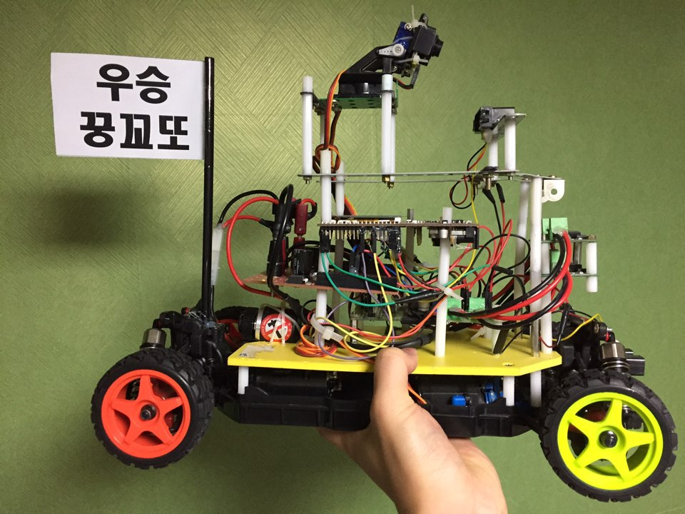

# IntelligentModelCar_2016
========
## Image
 

2016 지능형 모형차 경진대회 - 우승꿍꼬또 팀 보고서 및 Slimulink 파일 

## 개발 환경
 Matlab_R2015b
 Simulink

## Key Idea
1. 기본적인 하드웨어 제어를 제외한 모든 주행 알고리즘을 Simulink로 제작 - Code Generation을 적극 활용
2. TDD(Test-driven development)를 사용하여 개발 시간 매우 단축
3. 

## Content
1. <a href="https://github.com/proauto/IntelligentModelCar_2016/blob/master/Intelligent_Vehicle7.04/Intelligent_Vehicle.slx">Simulink File</a>
2. <a href="https://github.com/proauto/IntelligentModelCar_2016/blob/master/2016%20%EA%B2%BD%EC%A7%84%EB%8C%80%ED%9A%8C%20Mathworks%20%EB%B3%B4%EA%B3%A0%EC%84%9C_%ED%95%9C%EC%96%91%EB%8C%80%ED%95%99%EA%B5%90%20%EC%9A%B0%EC%8A%B9%EA%BF%8D%EA%BC%AC%EB%98%90%ED%8C%80.pdf">매트랩 보고서</a>
3. <a href="https://github.com/proauto/IntelligentModelCar_2016/blob/master/2016%20%EA%B2%BD%EC%A7%84%EB%8C%80%ED%9A%8C%20_%ED%95%9C%EC%96%91%EB%8C%80%ED%95%99%EA%B5%90%20%EC%9A%B0%EC%8A%B9%EA%BF%8D%EA%BC%AC%EB%98%90%ED%8C%80.pdf">지능형 차량 기본 보고서</a>

## News
1. <a href="http://www.mbn.co.kr/pages/news/newsView.php?news_seq_no=2948827">MBN News with Our Team's Photo</a>

